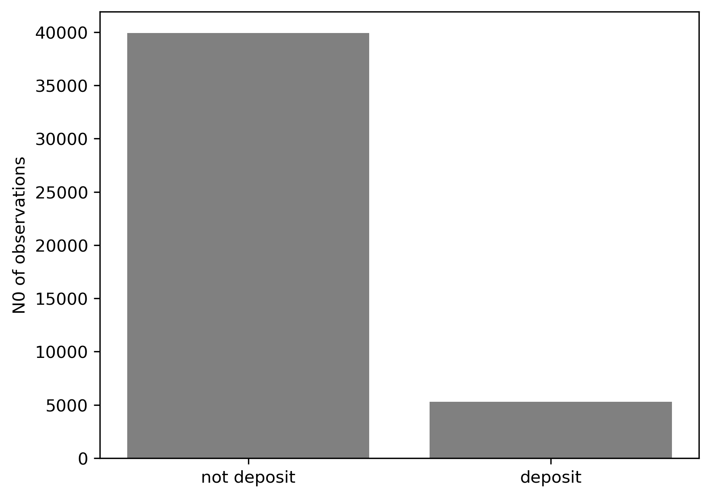
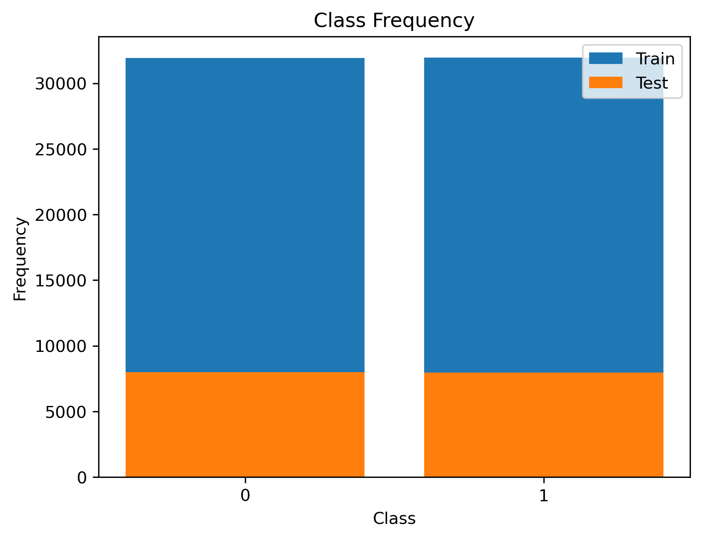

# 1.0   Introduction

This project develops and deploys a machine learning system that predicts whether a bank customer will subscribe to a term deposit based on demographic, financial, and campaign related attributes.

The overall objective of the project is to deploy an efficient machine learning model into production that is capable to predict whether a bank customer would make a deposit or not. The specific objectives are:

1. To identify features that are not making significant contribution to the deposit prediction model
2. To reduce the dimensionality while not jeopardizing the predictive power of the model
3. To provide users an efficient decision making platform

The prediction application is likely to support marketing decision making by:

- Identifying customers with high-probability of making deposit before campaign outreach
- Effectively allocating the resources of the bank
- Reducing the acquisition cost of customers that would likely make deposit
- Increasing the campaign conversion rates

The application uses a model that is trained on historical telemarketing campaign data and deployed using **Flask** as a web-based prediction application.

## 2.0  Data and Source

The application utilizes full historical telemarketing campaign dataset(2008-2010) that comprises 45,211 sample size. The dataset originates from a Portuguese banking institution’s direct marketing campaigns and made publicly available through UCI Machine Learning Repository, https://archive.ics.uci.edu/dataset/222/bank+marketing. The dataset comprises of 16 variables in total including the target variable, which include demography of customers, financial and campaign attributes of the customer.

Below is the breakdown of the variables included in the dataset:

`y` (target or dependent variable): Categorical

yes - Customer subscribed to term deposit

no - Customer did not subscribe

**Features or Independent variables:**

`Customer demographic attributes:`

1. Age (numerical), 2. Job (categorical), 3. Marital Status(categorical), 4. Education Level (categorical)

`Financial attributes:`

5. Balance (numerical): Average yearly balance, in euros, 6. Housing (categorical): Whether customer has housing loan, 7. Loan (categorical): Whether customer has personal loan, 8. Default (categorical): Whether customer has credit in default

`Campaign attributes:`

9. Contact (categorical): Communication channel used by the bank, 10. Day (numerical): Last contact day of the month 11. Month (categorical): Last contact month of the year 12.Campaign (numerical): Number of contacts performed during this campaign for the customer 13. PDAYS (numerical): Number of days passed by after the customer was last contacted from a previous campaign 14. Previous (numerical): Number of contacts performed before this campaign for the customer 15. Poutcome (categorical): Outcome of the previous marketing campaign

## 3.0   Feature Engineering

Dataset was scrutinzed and ensured it did not include missing values. The target variable was encoded such that 1 equals to 'Yes' and 0 to 'No', a crucial step in classification modeling. Though, Python's sklearn works fine without this step but it is safer that way. Then, the proportion of each category in the target variable was examined where it was discovered that 'No' (customer did not make deposit) dominated the target variable with approximately 88% of the target variable, as seen below:

    

This clearly indicates class imbalance which can distort classification model output. The imbalance of categories in the target variable was resolved by increasing the minor category (Yes-customer made deposit) by randomly resample minor category with replacement to match up with the major category (No). After this step, the target variable thus became balanced as seen below for both training and test dataset:

    

After class imbalance issue resolved, categorical features were transformed using one-hot encoding. To prevent multicollinearity, a baseline was established for each variable by dropping one category (dummy variable trap protocol). Similarly, to ensure that all numerical features are on the same scale, they are standardized using z-score transformation. This process, detailed in the formula below, centers the data around mean of zero with a standard deviation of one.

$$z = \frac{x - \mu}{\sigma}$$

* **$z$**: The standardized score (z-score).
* **$x$**: The original value (features) of the specific data point.
* **$\mu$**: The mean of the feature.
* **$\sigma$**: The standard deviation

## 4.0  Model: Stacked Ensemble Meta Model (SEMM)
The outcome of the application would be binary, Yes or No, indicating whether a customer would make a deposit or not. Therefore the application would use machine learning classification model. Logistic regression and Random Forest Classifier are both machine learning classification model capable to predict that a customer would make a deposit or not. This application combines the interpretability of logistic regression and predictive ability of Random Forest which captures non-linear relationships by adopting Stacked Ensemble META Model. For the purpose of this project, Logistic is used to test the statistical significance contribution of each features and as Meta model that produces final prediction. Random forest serves as the base learner model, the probabilities predicted from the base learner are then fed into logistic regression as features which Logistic regression uses to produce final outcome. These processes can be mathematically represented as follows:

### 4.1 `Logistic Regression:`

$$\ln\left(\frac{p}{1-p}\right) = \beta_0 + \beta_1x_1 + \beta_2x_2 + \dots + \beta_nx_n$$

*   **$p$**: The probability of the outcome (e.g., $y=1$).
*   **$\frac{p}{1-p}$**: The odds ratio.
*   **$\beta_0$**: The intercept.
*   **$\beta_n$**: The coefficient (weight) of the $n$-th feature
*   $x_1, \dots, x_n$: The features or independent variables

The equation above produces Log Odds, to find the actual probability of **p**, the equation is rearranged into `Sigmoid function` as seen below:

$$p = \frac{1}{1 + e^{-(\beta_0 + \beta_1x_1 + \dots + \beta_nx_n)}}$$

Alternatively, this can be simplified using the linear predictor $z$:

$$P(Y=1) = \sigma(z) = \frac{1}{1 + e^{-z}}$$
- Sigmoid function produces value between 0 and 1 representing the probability of Log Odds belonging to a particular category, which is then used to decide whether a customer would make deposit or not.

### 4.2 `Random Forest Classifier:`

Randon Forest Classifier is a homogenuous ensemble learning algorithm that combines multiple decision trees to improve predictive performance and reduce overfitting. It is based on Boostrap Aggregation (Bagging) and random feature selection at each split. Each tree is trained on a boostrap sample of random subset of features at each split. Then returns category with majority votes across the trees as the final prediction.

Random Forest Clasifier produces final prediction by following below steps:

Assuming we have $n$ observations, each with $p$ features, classified into $K$ possible categories. Then, the training dataset can be represented as:

$$
\mathcal{D} = \{(x_i, y_i)\}_{i=1}^{n}, 
\quad x_i \in \mathbb{R}^p, 
\quad y_i \in \{1, \dots, K\}
$$

where:
- $\mathcal{D}$ = Training Dataset
- $n$ = number of observations  
- $p$ = number of features  
- $K$ = number of classes
- $(x_i, y_i)$ = The $ith$ observation
- $x_i$ = Feature vector of observation $i$
- $y_i$ = Class label of observation $i$  

Then, bootstrap sampling (Bagging):

A bootstrap sample would be drawn as:

For each tree $b = 1, \dots, B$:

$$
\mathcal{D}^{(b)} 
\sim 
\text{SampleWithReplacement}(\mathcal{D})
$$

where:
- $B$ = Total number of Trees
- $b$ = Tree index
- $\mathcal{D}^{(b)}$ = Boostrap sample of tree $b$

Such that each tree can be trained on  $\mathcal{D}^{(b)}$.

Random Feature Selection at each split:

At each node, instead of considering all $(p)$ features, a random subset:

$$
\mathcal{M}^{(b)} \subset \{1, \dots, p\}, 
\quad |\mathcal{M}^{(b)}| = m
$$

is selected, where typically:

$$
m = \lfloor \sqrt{p} \rfloor
$$

The best split is chosen only among features in $( \mathcal{M}^{(b)} )$. At this stage, each tree is trained on randomly resampled version of the dataset. Some observations may appear multiple times and some may be excluded.

Tree-Level Prediction:

Here, each tree defines a classifier:

$$
T_b(x) : \mathbb{R}^p \rightarrow \{1, \dots, K\}
$$

At a terminal node $( \ell )$, the predicted class is:

$$
T_b(x) 
=
\arg\max_k 
\hat{P}^{(b)}(Y = k \mid x \in R_\ell)
$$

where:

$$
\hat{P}^{(b)}(Y = k \mid x \in R_\ell)
=
\frac{1}{|R_\ell|}
\sum_{i \in R_\ell}
\mathbf{1}(y_i = k)
$$

Forest level Aggregation (Majority Voting):

The Random Forest classifier is:

$$
\hat{f}_{RF}(x)=\arg\max_k\sum_{b=1}^{B}\mathbf{1}\big(T_b(x) = k\big)
$$

Each tree votes and the class with the highest number of votes is selected.

Probabilistic Form:

The estimated class probability is:

$$
\hat{P}_{RF}(Y = k \mid x)=\frac{1}{B}\sum_{b=1}^{B}\hat{P}^{(b)}(Y = k \mid x)
$$

Random Forest prediction:`

$$
\hat{f}_{RF}(x)=\arg\max_k\hat{P}_{RF}(Y = k \mid x)
$$

Impurity Minimization at each split:

For classification, splits minimize impurity: Gini Impurity

$$
G(t)=1 -\sum_{k=1}^{K} p_k^2
$$

Entropy

$$
H(t)=-\sum_{k=1}^{K}p_k \log p_k
$$

The optimal split $( s^*)$ is:

$$
s^* = \arg\min_s \left[ \frac{n_L}{n} I(L) + \frac{n_R}{n} I(R) \right]
$$

where:

- $I(\cdot)$ = Gini or Entropy  
- $n_L, n_R$ = samples in left/right nodes  

Bias–Variance Perspective

If each tree has:

- Variance $\sigma^2$ 
- Correlation $\rho$  

Then the variance of the forest is:

$$
\text{Var}(\hat{f}_{RF})=\rho \sigma^2+\frac{1-\rho}{B} \sigma^2
$$

As $B \to \infty$:

$$
\text{Var}(\hat{f}_{RF})
\to
\rho \sigma^2
$$

Note that increasing the number of trees reduces variance, but reducing correlation between trees is vital for strong performance.

Formal Summary:

Random Forest can finally be expressed as:

$$
\hat{f}_{RF}(x)
=
\frac{1}{B}
\sum_{b=1}^{B}
T_b(x;
\mathcal{D}^{(b)},
\mathcal{M}^{(b)})
$$

Randomness is injected through:
- Bootstrap sampling  
- Random feature selection  

This ensemble structure reduces variance while maintaining low bias, leading to strong generalization performance.

### 4.3 Stacked Ensemble Meta Model (SEMM)

The application adopts Stacked Ensemble structure. Random Forest Classifier serves as the base learner, and its output is refined by Logistic regression, the Meta model, to produce the final prediction.

1. The Base Learner (Random Forest Classifier)

The Random Forest processes the initial features and outputs a probability score $P_{RF}$.

$$P_{RF} = P(\text{Deposit} = \text{Yes} \mid \text{Input Features})$$

2. The Meta Learner (Logistic Regression)

Logistic regression (Meta model) takes the probability from the base learner and calculates the Log-Odds ($z$). This determines how to weight the Random forest's confidence.

$$z = \beta_0 + \beta_1(P_{RF})$$

where:
-   **$z$**: The Log-Odds, linear combination of Logstic regression
-   **$\beta_0$**: The Intercept (Bias)
-   **$\beta_1$**: The Coefficient
-  **$P_{RF}$**: The probability of a "Yes" predicted by the base Random forest model.

3. The Final Probability (Sigmoid Transformation)

To map the Log-Odds ($z$) back into a proper probability range between $0$ and $1$, Sigmoid Function is used:

$$\hat{P} = \frac{1}{1 + e^{-z}}$$

where:
-   **$\hat{P}$**: Final Meta probability

4. The decision rule (Binary Classification)

The continuous probability $\hat{P}$ is converted into a binary outcome based on a standard classification threshold:

$$\text{Outcome} = \begin{cases} 1:Yes & \text{if } \hat{P} \ge 0.5 \\ 0:No & \text{if } \hat{P} < 0.5 \end{cases}$$

### 4.4 `Results`

- **Logistic regression**

Logistic Regression is used first to test the statistical significance of the features. Table below present summary from the Logistic regression model:

<strong>Logit Regression Results</strong>

| Metric | Value |
|--------|--------|
| Dependent Variable | y |
| Number of Observations | 63,875 |
| Model | Logit |
| Degrees of Freedom (Residuals) | 63,833 |
| Method | MLE |
| Degrees of Freedom (Model) | 41 |
| Pseudo R-squared | 0.1759 |
| Log-Likelihood | -36,486 |
| Converged | True |
| LL-Null | -44,275 |
| Covariance Type | nonrobust |
| LLR p-value | 0.000 |

The above table shows the summary of logistic regression conducted to investigate the relationship between the target variable and independent variables. From the table, it is observable that model is built on 41 features (independent variables) with 63,875 observations which succesfully converged. The overall model was statistically significant as shown by the likelihood ratio test which compares the fitted model to the null alternative (intercept only) model $\chi^2(41) = 15, 578, p < 0.001$, suggesting that the features as a set distinctly distinguished between target outcomes. The model showed modest model fit as the predictors explains approximately 18% of the variance in the target variable $(Pseudo R-squared = 0.1759)$. The log-likelihood of the fitted model is -33,486 which suggest an improvement over the null model's log-likelihood of -44,275. Although, the predictors improve the model substantially, the question now is, are all these 41 features making significant contribution to the model?

Table below presents features that are not making statistical significant contribution to the model:

<strong>Non-significant Features</strong>

|  Features                 |   Coefficient |   p-value |   Odd Ratio |   Conf. Lower |   Conf. Upper | Sig.   |
|:--------------------------|--------------:|----------:|------------:|--------------:|--------------:|:-------|
| Job: Unemployed           |    0.0995332  |  0.081146 |    1.10466  |   -0.0123206  |     0.211387  | False  |
| Default: Yes              |   -0.0405     |  0.576121 |    0.960309 |   -0.182486   |     0.101486  | False  |
| Month: Jun                |    0.0669836  |  0.15605  |    1.06928  |   -0.0255698  |     0.159537  | False  |
| Previous Outcome: Unknown |   -0.041781   |  0.413758 |    0.95908  |   -0.141976   |     0.0584141 | False  |
| age                       |   -0.00591453 |  0.648358 |    0.994103 |   -0.0313336  |     0.0195046 | False  |
| day                       |    0.0116543  |  0.254127 |    1.01172  |   -0.00837584 |     0.0316845 | False  |

Logistic regression analysis conducted to investigate the significant effect of the independent variables on target variable. The results, as shown in the table above indicate that features such as unemployment status, credit default history, contacted in the month of June, unknown previous outcomes, age and contacted day of the month are not making a statistically significant contribution to the model. Each of these features returned p-value greater than 0.05, rendering them statistically insignificant. Thus, these features do not reliably predict the outcome. These findings suggest that the model may benefit from dimensionality reduction, that is removing these non-significant features which could imprrove the model's stability and overall predictive performance.

- **Stacked Ensemble Meta Model (SEMM)**: Below is the detailed evaluation of the Meta model

<strong>Classification Report</strong>

| Class | Precision | Recall | F1-Score | Support |
|------|-----------|--------|----------|--------|
| 0: NO | 0.97 | 0.92 | 0.95 | 7,983 |
| 1: YES | 0.92 | 0.97 | 0.95 | 7,986 |
| **Accuracy** | - | - | **0.95** | 15,969 |
| **Macro Avg** | 0.95 | 0.95 | 0.95 | 15,969 |
| **Weighted Avg** | 0.95 | 0.95 | 0.95 | 15,969 |

The classification meta model report shows that the model performed very well in distinguishing between customers who subscribed to the term deposit and those who did not. The non-susbcriber class (No), the meta model achieved a precision of 0.97 and recall of 0.92, resulted in F1-score of 0.95. This indicates that majority predictions of non-subscription were correct, with small proportion of actual non-subscribers were misclassified. For the subscriber class (Yes), the meta model returned a precision of 0.92 and recall of 0.97 resulting to an F1-score of 0.95. This indicates that the model is highly effective in identifying customers who actually subscribed to the deposit product.

Overall, the meta model achieved an accuracy of 0.95, which suggests the model correctly classifying the vast majority of observations. Macro and Weighted Averages are also 0.95 across precision, recall and F1-score, pointing towards balanced performance across the target classes. Given the nearly equal class support ($n$ = 7, 983 for No and $n$ = 7,986 for Yes), these results suggests that the model exhibits consistent predictive performance without substantial bias toward either class, making it reliable for predicting customer subscription outcomes.

<strong>Confusion Matrix</strong>

| Class      | 0: NO | 1: YES |
|--------------------|-------|--------|
| **0: NO**  | 7352 | 631 |
| **1: YES** | 221 | 7765 |

The confusion matrix table above shows that the meta model performed strongly in distinguishing between customers who subscribed to the term deposit and those who did not. The model correctly classified 7,352 non-subscribers (True Negatives) and 7,765 subscribers (True Positives). Although,631 non-subscribers wre incorrectly classified as subscribers (False Positives) and 221 subscribers were incorrectly classified as non-subscribers (False Negatives). Overall, the relatively smaal number of misclassifications compared to the large number of correct predictions indicates strong model performance. Specifically, the low number of false negatives indicates that model is highly effective in identifying potential subscribers which is beneficial in a marketing context because it minimizes the rist of missing customers who are likely to accept the deposit offer. Consequently, theese results suggest that the meta model provides reliable predictions and can effectively support targeted marketing strategies in banking campaigns.

<strong>Stability of the Model</strong>

| Metric                         | Value  |
|--------------------------------|--------|
| Meta Model Accuracy (5-fold Average) | 0.9338 |
| Standard Deviation             | 0.0011 |

The above table presents the Cross-validation of themeta model across 5-fold. Theses results indicate that the meta model in the stacking ensemble demonstrates strong and highly stable predictive performance. The 5-fold average accuracy of 0.9338 (93.38%) indicates that, across five different validation splits, the meta model correctly classified approximately 93% of observations on average. This points that the ensemble method where the Random forest generates probability predictions and Logistic Regression serves as the meta learner generalizes well to unseen data. That means, the meta model effectively learns how to combine the base model output to produce reliable final predictions.

The standard deviation of 0.0011 is extremely small, indicated that the model's performance is highly consistent across all the 5 validation folds. Low variability in cross-validation implies that the model is not sensitive to any particular train validation splits which reflects model's robustness and stability. Therefore, it can be concluded that the stacking framework is well calibrated and not overfitting since the performance remains nearly identical across different subsets of the data. The combination of high average acuracy and minimal variation indicates that the ensemble method adopted is reliable for predicting customers deposit subscription behavior and is likely to maintain similar outcome when deployed into production environments.

## 5.0 Conclusion

The main objective of the project is to deploy an efficient machine learning model that is capable to predict whether a customer would subscribe to a term deposit during a marketing campaign. The model is trained on historical Portuguese banking institution’s direct marketing campaign (2008-2010) dataset with 45, 211 observations, the dataset consist of 16 variables including the target variable. The project implemented structured machine learning included data preprocessing, feature engineering, model training and testing, model evaluation and model deployment through a web-based framework (Flask). An ensemble stacking methods was adopted which combines Random Forest as the base learner and Logistic regression as the meta model. This method allws the meta model to learn how to optimally combine probability outputs from the base model to improve classification performance. The meta model demonstrated strong predictive capability, achieving an overall accuracy of approximately $95%$ with balanced precision, recall and F1-score across both subscriber and non-subscribers. 

Evaluation through confusion matrix further indicated that the model correctly classified the vast majority of customers, with relatively few False positives and False negatives. Such balanced performance indicates that the model is effective at identifying both potential subscribers and non-subscribers without exhibiting substantial bias toward either class. Stability of the model evaluated using cross-validation of 5-fold, the result suggests a very stable performance with average accuracy of 0.9338 with very low deviation accross the 5-fold, suggesting strong generalization capability. Practically, the deployed Deposit Prediction App allows users to input customer's, financial and campaign attributes then receice an immediate prediction regarding the likelihood of deposit subscription. This application can support banking institutions in priortizing high probability customers, improve target strategies and optimize bank and marketing resources. Generally, this project showcases how machine learning models can be translated into practical decision support tools within financial institutions, filling the lapse between analytical modeling and a real world application.